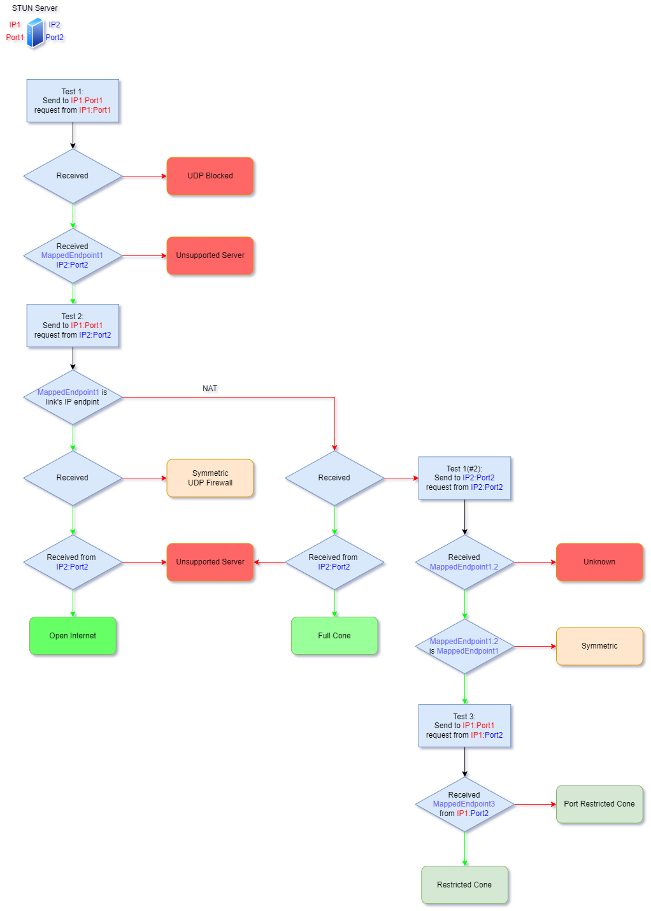

# NatTypeTester
Channel | Status
-|-
CI | 
Stun.Net | 

## RFC

* [RFC 3489](https://datatracker.ietf.org/doc/html/rfc3489)
* [RFC 5780](https://datatracker.ietf.org/doc/html/rfc5780)
* [RFC 8489](https://datatracker.ietf.org/doc/html/rfc8489)

## Internet Protocol

- [x] IPv4
- [x] IPv6

## Transmission Protocol

- [x] UDP
- [x] TCP
- [x] TLS-over-TCP
- [ ] DTLS-over-UDP

## RFC3489

## RFC5389
### Binding Test

  
Checking for UDP Connectivity with the STUN Server

### Mapping Behavior

  
Determining NAT Mapping Behavior

### Filtering Behavior

  
Determining NAT Filtering Behavior

### Combining Tests

