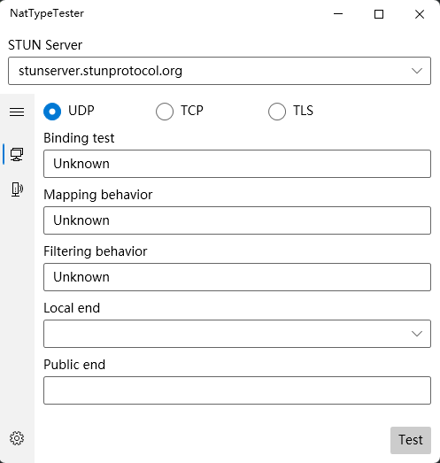

# NatTypeTester

## RFC supports

- [x] [RFC 3489](https://tools.ietf.org/html/rfc3489)
- [x] [RFC 5389](https://tools.ietf.org/html/rfc5389)
- [x] [RFC 5769](https://tools.ietf.org/html/rfc5769)
- [x] [RFC 5780](https://tools.ietf.org/html/rfc5780)
- [ ] [RFC 7350](https://tools.ietf.org/html/rfc7350)
- [ ] [RFC 7443](https://tools.ietf.org/html/rfc7443)
- [ ] [RFC 7635](https://tools.ietf.org/html/rfc7635)
- [ ] [RFC 8489](https://tools.ietf.org/html/rfc8489)

## Internet Protocol

- [x] IPv4
- [x] IPv6

## Transmission Protocol

- [x] UDP
- [ ] TCP
- [ ] TLS-over-TCP
- [ ] DTLS-over-UDP

## Preview


## STUN Server
### Docker
```
docker pull hmbsbige/stunserver
docker run -d --restart=always --net=host --name=stunserver hmbsbige/stunserver --mode full --primaryinterface $IP1 --altinterface $IP2
```
