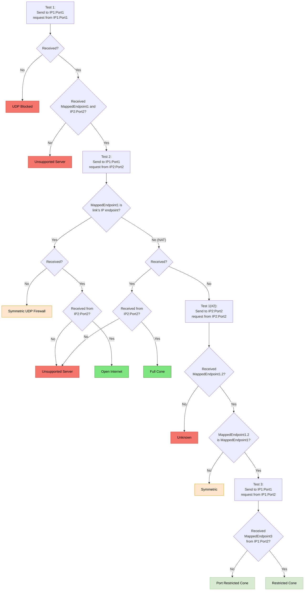
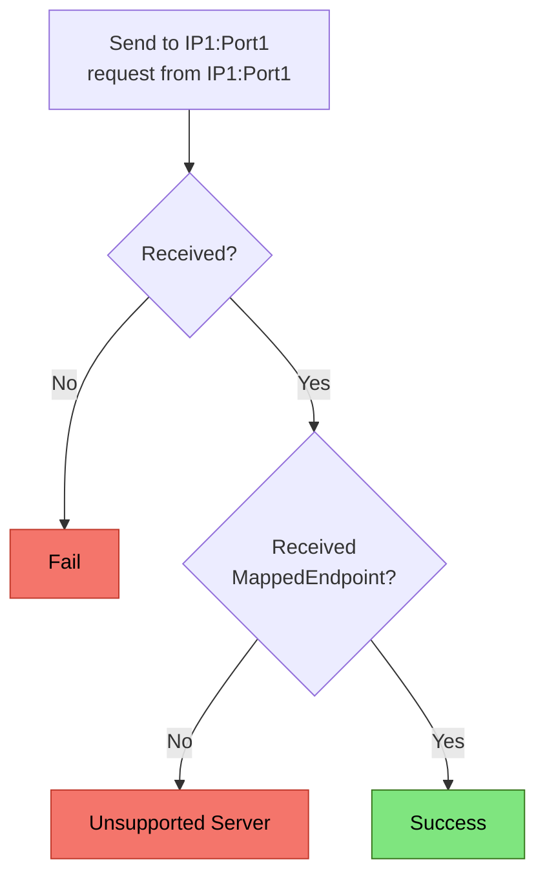
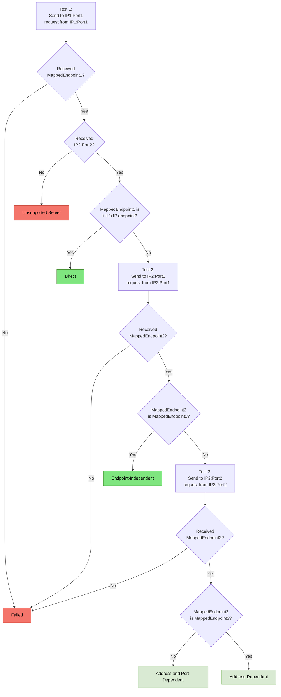
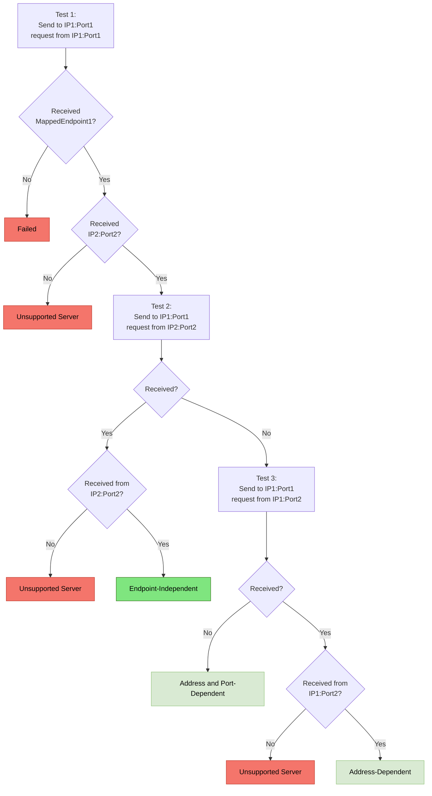
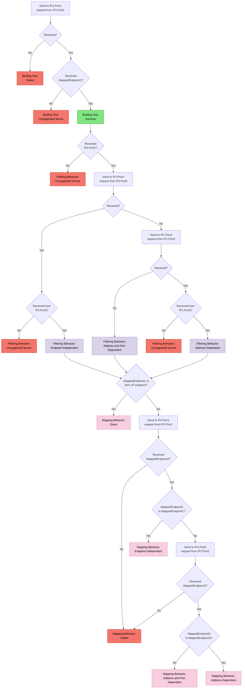

# NatTypeTester

| Channel  | Status                                                                                                                       |
| -------- | ---------------------------------------------------------------------------------------------------------------------------- |
| CI       |  |
| Stun.Net |              |

## RFC

- [RFC 3489](https://datatracker.ietf.org/doc/html/rfc3489)
- [RFC 5780](https://datatracker.ietf.org/doc/html/rfc5780)
- [RFC 8489](https://datatracker.ietf.org/doc/html/rfc8489)

## Internet Protocol

- [x] IPv4
- [x] IPv6

## Transmission Protocol

- [x] UDP
- [x] TCP
- [x] TLS-over-TCP
- [x] DTLS-over-UDP

## RFC3489

> The STUN server has two IP addresses (`IP1`, `IP2`), each listening on two ports (`Port1`, `Port2`).
> *Send to X, request from Y* means the request is sent to endpoint `X`, asking the server to reply from endpoint `Y`.

```mermaid
flowchart TD
    T1["Test 1:<br>Send to IP1:Port1<br>request from IP1:Port1"] --> R1{"Received?"}
    R1 -->|No| B1["UDP Blocked"]:::bad
    R1 -->|Yes| R2{"Received<br>MappedEndpoint1 and<br>IP2:Port2?"}
    R2 -->|No| B2["Unsupported Server"]:::bad
    R2 -->|Yes| T2["Test 2:<br>Send to IP1:Port1<br>request from IP2:Port2"]
    T2 --> D1{"MappedEndpoint1 is<br>link's IP endpoint?"}
    D1 -->|Yes| R3{"Received?"}
    R3 -->|No| W1["Symmetric UDP Firewall"]:::warn
    R3 -->|Yes| R4{"Received from<br>IP2:Port2?"}
    R4 -->|No| B3["Unsupported Server"]:::bad
    R4 -->|Yes| G1["Open Internet"]:::good
    D1 -->|"No (NAT)"| R5{"Received?"}
    R5 -->|Yes| R6{"Received from<br>IP2:Port2?"}
    R6 -->|No| B3
    R6 -->|Yes| G2["Full Cone"]:::good
    R5 -->|No| T12["Test 1(#35;2):<br>Send to IP2:Port2<br>request from IP2:Port2"]
    T12 --> R7{"Received<br>MappedEndpoint1.2?"}
    R7 -->|No| B4["Unknown"]:::bad
    R7 -->|Yes| D2{"MappedEndpoint1.2<br>is MappedEndpoint1?"}
    D2 -->|No| W2["Symmetric"]:::warn
    D2 -->|Yes| T3["Test 3:<br>Send to IP1:Port1<br>request from IP1:Port2"]
    T3 --> R8{"Received<br>MappedEndpoint3<br>from IP1:Port2?"}
    R8 -->|No| M1["Port Restricted Cone"]:::mild
    R8 -->|Yes| M2["Restricted Cone"]:::mild

    classDef bad fill:#f4756b,stroke:#c0392b,color:#000
    classDef warn fill:#ffe6cc,stroke:#d79b00,color:#000
    classDef good fill:#7fe57f,stroke:#38761d,color:#000
    classDef mild fill:#d9ead3,stroke:#93c47d,color:#000
```

## RFC5389

> The STUN server has two IP addresses (`IP1`, `IP2`), each listening on two ports (`Port1`, `Port2`).
> *Send to X, request from Y* means the request is sent to endpoint `X`, asking the server to reply from endpoint `Y`.

### Binding Test

  
Checking for UDP Connectivity with the STUN Server

```mermaid
flowchart TD
    T1["Send to IP1:Port1<br>request from IP1:Port1"] --> R1{"Received?"}
    R1 -->|No| B1["Fail"]:::bad
    R1 -->|Yes| R2{"Received<br>MappedEndpoint?"}
    R2 -->|No| B2["Unsupported Server"]:::bad
    R2 -->|Yes| G1["Success"]:::good

    classDef bad fill:#f4756b,stroke:#c0392b,color:#000
    classDef good fill:#7fe57f,stroke:#38761d,color:#000
```

### Mapping Behavior

  
Determining NAT Mapping Behavior

```mermaid
flowchart TD
    T1["Test 1:<br>Send to IP1:Port1<br>request from IP1:Port1"] --> R1{"Received<br>MappedEndpoint1?"}
    R1 -->|No| B1["Failed"]:::bad
    R1 -->|Yes| R2{"Received<br>IP2:Port2?"}
    R2 -->|No| B2["Unsupported Server"]:::bad
    R2 -->|Yes| D1{"MappedEndpoint1 is<br>link's IP endpoint?"}
    D1 -->|Yes| G1["Direct"]:::good
    D1 -->|No| T2["Test 2:<br>Send to IP2:Port1<br>request from IP2:Port1"]
    T2 --> R3{"Received<br>MappedEndpoint2?"}
    R3 -->|No| B1
    R3 -->|Yes| D2{"MappedEndpoint2<br>is MappedEndpoint1?"}
    D2 -->|Yes| G2["Endpoint-Independent"]:::good
    D2 -->|No| T3["Test 3:<br>Send to IP2:Port2<br>request from IP2:Port2"]
    T3 --> R4{"Received<br>MappedEndpoint3?"}
    R4 -->|No| B1
    R4 -->|Yes| D3{"MappedEndpoint3<br>is MappedEndpoint2?"}
    D3 -->|No| M1["Address and Port-Dependent"]:::mild
    D3 -->|Yes| M2["Address-Dependent"]:::mild

    classDef bad fill:#f4756b,stroke:#c0392b,color:#000
    classDef good fill:#7fe57f,stroke:#38761d,color:#000
    classDef mild fill:#d9ead3,stroke:#93c47d,color:#000
```

### Filtering Behavior

  
Determining NAT Filtering Behavior

```mermaid
flowchart TD
    T1["Test 1:<br>Send to IP1:Port1<br>request from IP1:Port1"] --> R1{"Received<br>MappedEndpoint1?"}
    R1 -->|No| B1["Failed"]:::bad
    R1 -->|Yes| R2{"Received<br>IP2:Port2?"}
    R2 -->|No| B2["Unsupported Server"]:::bad
    R2 -->|Yes| T2["Test 2:<br>Send to IP1:Port1<br>request from IP2:Port2"]
    T2 --> R3{"Received?"}
    R3 -->|Yes| R4{"Received from<br>IP2:Port2?"}
    R4 -->|No| B3["Unsupported Server"]:::bad
    R4 -->|Yes| G1["Endpoint-Independent"]:::good
    R3 -->|No| T3["Test 3:<br>Send to IP1:Port1<br>request from IP1:Port2"]
    T3 --> R5{"Received?"}
    R5 -->|No| M1["Address and Port-Dependent"]:::mild
    R5 -->|Yes| R6{"Received from<br>IP1:Port2?"}
    R6 -->|No| B4["Unsupported Server"]:::bad
    R6 -->|Yes| M2["Address-Dependent"]:::mild

    classDef bad fill:#f4756b,stroke:#c0392b,color:#000
    classDef good fill:#7fe57f,stroke:#38761d,color:#000
    classDef mild fill:#d9ead3,stroke:#93c47d,color:#000
```

### Combining Tests

```mermaid
flowchart TD
    S1["Send to IP1:Port1<br>request from IP1:Port1"] --> R1{"Received?"}
    R1 -->|No| B1["Binding Test:<br>Failed"]:::bad
    R1 -->|Yes| R2{"Received<br>MappedEndpoint1?"}
    R2 -->|No| B2["Binding Test:<br>Unsupported Server"]:::bad
    R2 -->|Yes| OK1["Binding Test:<br>Success"]:::good
    OK1 --> R3{"Received<br>IP2:Port2?"}
    R3 -->|No| B3["Filtering Behavior:<br>Unsupported Server"]:::bad
    R3 -->|Yes| S2["Send to IP1:Port1<br>request from IP2:Port2"]
    S2 --> R4{"Received?"}
    R4 -->|Yes| R5{"Received from<br>IP2:Port2?"}
    R5 -->|No| B4["Filtering Behavior:<br>Unsupported Server"]:::bad
    R5 -->|Yes| F1["Filtering Behavior:<br>Endpoint-Independent"]:::filt
    R4 -->|No| S3["Send to IP1:Port1<br>request from IP1:Port2"]
    S3 --> R6{"Received?"}
    R6 -->|No| F3["Filtering Behavior:<br>Address and Port-Dependent"]:::filt
    R6 -->|Yes| R7{"Received from<br>IP1:Port2?"}
    R7 -->|No| B5["Filtering Behavior:<br>Unsupported Server"]:::bad
    R7 -->|Yes| F2["Filtering Behavior:<br>Address-Dependent"]:::filt
    F1 --> D1{"MappedEndpoint1 is<br>link's IP endpoint?"}
    F2 --> D1
    F3 --> D1
    D1 -->|Yes| P1["Mapping Behavior:<br>Direct"]:::map
    D1 -->|No| S4["Send to IP2:Port1<br>request from IP2:Port1"]
    S4 --> R8{"Received<br>MappedEndpoint2?"}
    R8 -->|No| B6["Mapping Behavior:<br>Failed"]:::bad
    R8 -->|Yes| D2{"MappedEndpoint2<br>is MappedEndpoint1?"}
    D2 -->|Yes| P2["Mapping Behavior:<br>Endpoint-Independent"]:::map
    D2 -->|No| S5["Send to IP2:Port2<br>request from IP2:Port2"]
    S5 --> R9{"Received<br>MappedEndpoint3?"}
    R9 -->|No| B6
    R9 -->|Yes| D3{"MappedEndpoint3<br>is MappedEndpoint2?"}
    D3 -->|No| P3["Mapping Behavior:<br>Address and Port-Dependent"]:::map
    D3 -->|Yes| P4["Mapping Behavior:<br>Address-Dependent"]:::map

    classDef bad fill:#f4756b,stroke:#c0392b,color:#000
    classDef good fill:#7fe57f,stroke:#38761d,color:#000
    classDef filt fill:#d9d2e9,stroke:#8e7cc3,color:#000
    classDef map fill:#f8cde0,stroke:#c27ba0,color:#000
```

